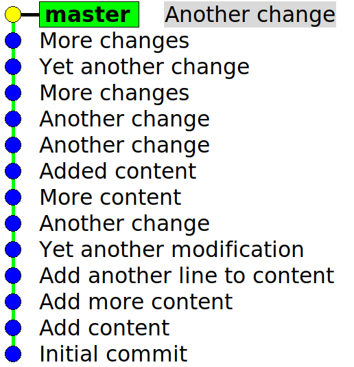
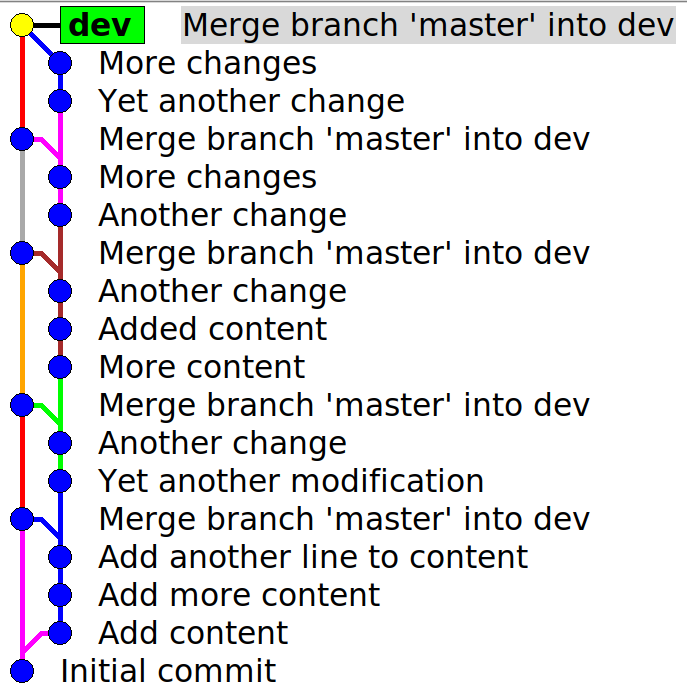
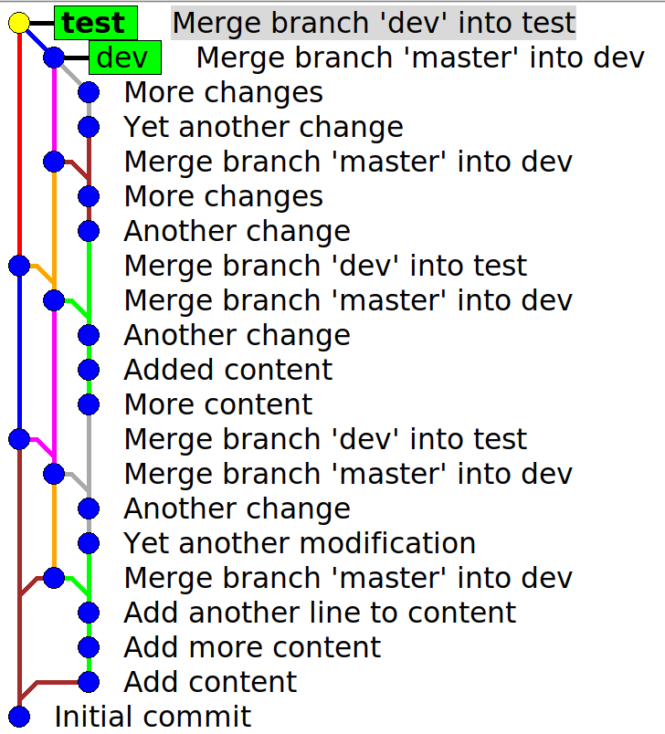
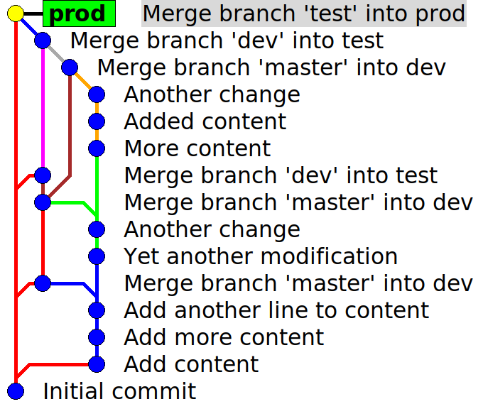
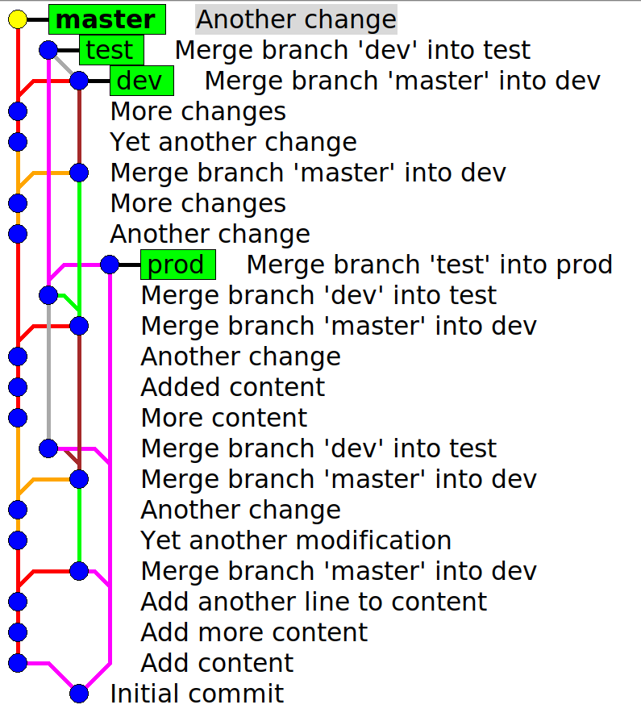

# Example of no-ff merges

## Master branch

`master` branch with a linear history:



## Development branch

`master` branch is periodically merged to `dev` branch.

```shell
git checkout dev
git merge --no-ff master
```



## Test branch

`dev` branch is periodically merged to `test` branch.

```shell
git checkout test
git merge --no-ff dev
```



## Production branch

`test` branch is periodically merged to `prod` branch.

```shell
git checkout prod
git merge --no-ff test
```



## All branches



# Observations

- The "all branches" view gets complicated quite fast, but individual `dev`/`test`/`prod` branches look ok
- You can edit the commit message when performing a merge, e.g. for adding some semantic meaning to the merge:
  - "Merge for release 1.2.3"
- Plain `git rebase` will discard merge commits
  - If you accidentally make a local commit to e.g. `dev` branch and use `rebase` to remove it, you might accidentally also remove the "merge branch 'master' into dev" -commits.
  - `git rebase -i --rebase-merges [commit]` will preserve merge commits
